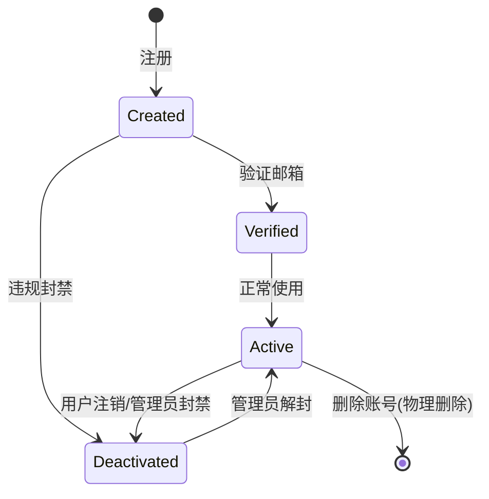
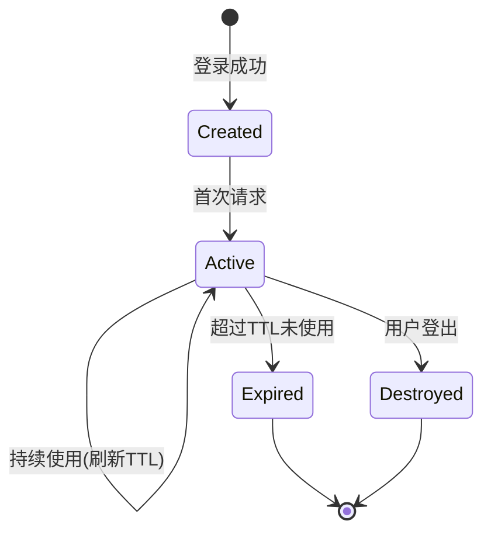
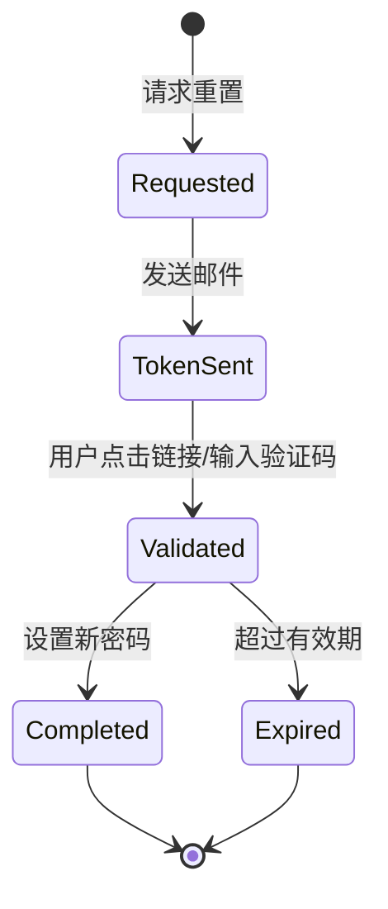

# Data Model: 前后端鉴权集成

**Feature**: 002-auth-integration
**Date**: 2026-01-16
**Status**: Approved

## Overview

本文档定义了鉴权功能相关的所有数据模型,包括数据库表结构、Redis存储结构、以及前后端数据传输格式。

---

## Database Models

### 1. User (用户表)

**表名**: `users`

**描述**: 存储用户账号基本信息和认证凭据

#### 字段定义

| 字段名 | 类型 | 约束 | 描述 |
|--------|------|------|------|
| `id` | UUID | PRIMARY KEY | 用户唯一标识符 |
| `email` | VARCHAR(255) | UNIQUE, NOT NULL, INDEX | 用户邮箱(登录凭据) |
| `name` | VARCHAR(100) | NOT NULL | 用户显示名称 |
| `password_hash` | VARCHAR(255) | NOT NULL | bcrypt哈希后的密码 |
| `is_active` | BOOLEAN | NOT NULL, DEFAULT true, INDEX | 账号是否激活 |
| `is_verified` | BOOLEAN | NOT NULL, DEFAULT false | 邮箱是否已验证 |
| `sso_provider` | VARCHAR(50) | NULLABLE | SSO提供商(google, azure等) |
| `sso_provider_id` | VARCHAR(255) | NULLABLE, INDEX | SSO提供商的用户ID |
| `created_at` | TIMESTAMP WITH TIME ZONE | NOT NULL, DEFAULT NOW() | 账号创建时间 |
| `updated_at` | TIMESTAMP WITH TIME ZONE | NOT NULL, DEFAULT NOW() | 最后更新时间 |
| `last_login_at` | TIMESTAMP WITH TIME ZONE | NULLABLE | 最后登录时间 |
| `email_verified_at` | TIMESTAMP WITH TIME ZONE | NULLABLE | 邮箱验证时间 |

#### 索引

```sql
CREATE UNIQUE INDEX idx_users_email ON users(email);
CREATE INDEX idx_users_is_active ON users(is_active);
CREATE INDEX idx_users_sso_provider_id ON users(sso_provider_id);
```

#### 约束

- `email`: 必须符合邮箱格式,唯一性约束
- `password_hash`: bcrypt哈希,cost factor >= 12
- `is_active`: 用于软禁用用户,禁用后无法登录
- `is_verified`: 标记邮箱是否已验证(注册时通过验证码验证)

#### 业务规则

1. **邮箱唯一性**: 同一邮箱只能注册一个账号
2. **密码强度**: 前端和后端双重验证(8+字符,大小写字母,数字,特殊字符)
3. **软删除**: 用户账号不物理删除,通过`is_active=false`标记禁用
4. **SSO链接**: 用户可以通过SSO登录,首次登录时创建账号或链接现有邮箱账号

---

### 2. UserLoginHistory (登录历史表)

**表名**: `user_login_history`

**描述**: 记录所有登录尝试(成功和失败),用于安全审计和异常检测

#### 字段定义

| 字段名 | 类型 | 约束 | 描述 |
|--------|------|------|------|
| `id` | UUID | PRIMARY KEY | 记录唯一标识符 |
| `user_id` | UUID | NOT NULL, INDEX | 关联的用户ID |
| `ip_address` | VARCHAR(45) | NULLABLE | 客户端IP地址(支持IPv6) |
| `user_agent` | TEXT | NULLABLE | 客户端User-Agent字符串 |
| `success` | BOOLEAN | NOT NULL, DEFAULT true | 登录是否成功 |
| `failure_reason` | VARCHAR(255) | NULLABLE | 失败原因(如"密码错误") |
| `sso_provider` | VARCHAR(50) | NULLABLE | SSO提供商(如果使用SSO登录) |
| `created_at` | TIMESTAMP WITH TIME ZONE | NOT NULL, DEFAULT NOW(), INDEX | 登录尝试时间 |

#### 索引

```sql
CREATE INDEX idx_user_login_history_user_id ON user_login_history(user_id);
CREATE INDEX idx_user_login_history_created_at ON user_login_history(created_at);
```

#### 业务规则

1. **记录所有尝试**: 无论成功或失败,都记录登录尝试
2. **失败尝试**: 记录失败原因,但不透露具体是邮箱不存在还是密码错误
3. **数据保留**: 登录历史保留90天,超过后自动归档或删除
4. **安全分析**: 用于检测暴力破解、异常登录位置等安全威胁

#### 查询示例

```sql
-- 查询用户最近10次登录记录
SELECT * FROM user_login_history
WHERE user_id = '...'
ORDER BY created_at DESC
LIMIT 10;

-- 统计过去24小时内失败的登录尝试
SELECT user_id, COUNT(*) as failure_count
FROM user_login_history
WHERE success = false
  AND created_at > NOW() - INTERVAL '24 hours'
GROUP BY user_id
HAVING COUNT(*) > 5;
```

---

### 3. UserPasswordReset (密码重置表)

**表名**: `user_password_resets`

**描述**: 存储密码重置令牌和验证码,支持两种重置方式

#### 字段定义

| 字段名 | 类型 | 约束 | 描述 |
|--------|------|------|------|
| `id` | UUID | PRIMARY KEY | 记录唯一标识符 |
| `user_id` | UUID | NOT NULL, INDEX | 关联的用户ID |
| `token` | VARCHAR(255) | UNIQUE, NOT NULL, INDEX | 重置令牌(URL安全) |
| `code` | VARCHAR(10) | NULLABLE | 6位数字验证码(可选) |
| `used` | BOOLEAN | NOT NULL, DEFAULT false | 令牌是否已使用 |
| `used_at` | TIMESTAMP WITH TIME ZONE | NULLABLE | 使用时间 |
| `expires_at` | TIMESTAMP WITH TIME ZONE | NOT NULL | 过期时间 |
| `created_at` | TIMESTAMP WITH TIME ZONE | NOT NULL, DEFAULT NOW() | 创建时间 |

#### 索引

```sql
CREATE UNIQUE INDEX idx_user_password_resets_token ON user_password_resets(token);
CREATE INDEX idx_user_password_resets_user_id ON user_password_resets(user_id);
```

#### 业务规则

1. **两种模式**:
   - Token模式: 用户点击邮件中的链接,URL包含token
   - Code模式: 用户手动输入邮件中的6位验证码
   - 支持混合模式(同时生成token和code)

2. **有效期**:
   - Token: 1小时
   - Code: 15分钟

3. **一次性使用**: 令牌使用后立即标记`used=true`,防止重复使用

4. **安全措施**:
   - Token使用密码学安全的随机数生成器
   - 重置成功后销毁所有用户会话,要求重新登录
   - 请求重置时不透露用户是否存在

#### 查询示例

```sql
-- 查找有效的重置令牌
SELECT * FROM user_password_resets
WHERE token = '...'
  AND used = false
  AND expires_at > NOW();

-- 清理过期的重置记录(定时任务)
DELETE FROM user_password_resets
WHERE expires_at < NOW() - INTERVAL '7 days';
```

---

## Redis Data Structures

### 1. Session (会话存储)

**Key格式**: `session:{session_id}`

**数据结构**: Hash

**TTL**:
- 普通会话: 86400秒(24小时)
- "记住我": 2592000秒(30天)

#### 字段定义

| 字段名 | 类型 | 描述 |
|--------|------|------|
| `user_id` | String(UUID) | 用户ID |
| `email` | String | 用户邮箱 |
| `name` | String | 用户名称 |
| `ip_address` | String | 登录时的IP地址 |
| `user_agent` | String | 登录时的User-Agent |
| `created_at` | String(ISO8601) | 会话创建时间 |
| `last_accessed_at` | String(ISO8601) | 最后访问时间 |

#### Redis命令示例

```redis
# 创建会话
HSET session:abc123 user_id "550e8400-e29b-41d4-a716-446655440000"
HSET session:abc123 email "user@example.com"
HSET session:abc123 name "张三"
HSET session:abc123 created_at "2026-01-16T10:30:00Z"
EXPIRE session:abc123 86400

# 获取会话
HGETALL session:abc123

# 销毁会话
DEL session:abc123

# 检查会话是否存在
EXISTS session:abc123
```

---

### 2. User Sessions Set (用户会话集合)

**Key格式**: `session:user:{user_id}`

**数据结构**: Set

**TTL**: 与最长会话TTL一致(30天)

**描述**: 存储用户所有活跃会话的session_id,用于:
- 统计用户并发会话数
- 限制最大会话数(默认10个)
- 一键销毁用户所有会话

#### Redis命令示例

```redis
# 添加会话到用户集合
SADD session:user:550e8400-e29b-41d4-a716-446655440000 session:abc123

# 获取用户所有会话
SMEMBERS session:user:550e8400-e29b-41d4-a716-446655440000

# 统计用户会话数
SCARD session:user:550e8400-e29b-41d4-a716-446655440000

# 销毁用户所有会话
SMEMBERS session:user:550e8400-e29b-41d4-a716-446655440000
# 然后对每个session_id执行DEL
```

---

### 3. Verification Code (验证码存储)

**Key格式**: `verify:code:{email}`

**数据结构**: String

**TTL**: 300秒(5分钟)

**描述**: 存储注册时的邮箱验证码,6位数字

#### Redis命令示例

```redis
# 创建验证码
SET verify:code:user@example.com "123456" EX 300

# 获取验证码
GET verify:code:user@example.com

# 验证后删除
DEL verify:code:user@example.com
```

---

### 4. Rate Limit (速率限制)

**Key格式**:
- 登录: `rate:login:{ip}:{email}`
- 验证码: `rate:send_code:{email}`

**数据结构**: String (计数器)

**TTL**:
- 登录: 300秒(5分钟)
- 验证码: 60秒(1分钟)

#### Redis命令示例

```redis
# 记录登录尝试
INCR rate:login:192.168.1.1:user@example.com
EXPIRE rate:login:192.168.1.1:user@example.com 300

# 检查是否超过限制
GET rate:login:192.168.1.1:user@example.com
# 如果返回值 >= 5,则拒绝请求

# 登录成功后重置计数
DEL rate:login:192.168.1.1:user@example.com
```

---

### 5. IP Ban (IP封禁)

**Key格式**: `ban:ip:{ip_address}`

**数据结构**: String (标记)

**TTL**: 3600秒(1小时)

**描述**: 临时封禁频繁尝试登录的IP地址

#### Redis命令示例

```redis
# 封禁IP
SET ban:ip:192.168.1.1 "1" EX 3600

# 检查IP是否被封禁
EXISTS ban:ip:192.168.1.1
```

---

## Frontend Data Types

### 1. AuthContext State

**描述**: 前端认证上下文状态

```typescript
interface AuthState {
  user: User | null           // 当前登录用户信息
  isAuthenticated: boolean    // 是否已登录
  isLoading: boolean          // 是否正在加载用户信息
  error: Error | null         // 认证错误
}
```

### 2. User Type

**描述**: 前端用户数据类型

```typescript
interface User {
  id: string                  // 用户ID(UUID字符串)
  email: string               // 邮箱
  name: string                // 显示名称
  is_active: boolean          // 账号是否激活
  is_verified: boolean        // 邮箱是否已验证
  created_at: string | null   // 创建时间(ISO8601)
  last_login_at: string | null // 最后登录时间(ISO8601)
}
```

### 3. Login Form Data

**描述**: 登录表单数据

```typescript
interface LoginFormData {
  email: string               // 邮箱
  password: string            // 密码(明文,仅在提交时使用)
  remember_me: boolean        // 是否记住我
}
```

### 4. Register Form Data

**描述**: 注册表单数据

```typescript
interface RegisterFormData {
  email: string               // 邮箱
  verification_code: string   // 验证码
  password: string            // 密码
  name: string                // 显示名称(可选)
}
```

### 5. Reset Password Form Data

**描述**: 重置密码表单数据

```typescript
interface ResetPasswordFormData {
  token?: string              // 重置令牌(URL参数)
  code?: string               // 验证码(手动输入)
  new_password: string        // 新密码
}
```

---

## API Response Formats

### 1. Standard Success Response

```json
{
  "success": true,
  "message": "操作成功",
  "data": { ... }
}
```

### 2. Standard Error Response

```json
{
  "success": false,
  "error": {
    "code": "INVALID_CREDENTIALS",
    "message": "邮箱或密码错误",
    "details": null
  }
}
```

### 3. Login Success Response

```json
{
  "success": true,
  "message": "登录成功",
  "user": {
    "id": "550e8400-e29b-41d4-a716-446655440000",
    "email": "user@example.com",
    "name": "张三",
    "is_active": true,
    "is_verified": true,
    "created_at": "2026-01-15T10:00:00Z",
    "last_login_at": "2026-01-16T10:30:00Z"
  },
  "redirect_to": "http://localhost:5173/dashboard/homepage"
}
```

### 4. Validation Error Response

```json
{
  "success": false,
  "error": {
    "code": "WEAK_PASSWORD",
    "message": "密码强度不足",
    "details": ["至少8个字符", "包含大写字母", "包含数字"]
  }
}
```

---

## Data Validation Rules

### 1. Email Validation

- **格式**: 符合RFC 5322标准
- **最大长度**: 255字符
- **示例**: `user@example.com`, `test+tag@domain.co.uk`

### 2. Password Validation

**注册和重置时的要求**:
- 最小长度: 8字符
- 最大长度: 128字符
- 必须包含:
  - 至少1个大写字母(A-Z)
  - 至少1个小写字母(a-z)
  - 至少1个数字(0-9)
  - 至少1个特殊字符(!@#$%^&*等)

**登录时的要求**:
- 最小长度: 1字符(仅验证非空)
- 最大长度: 255字符

### 3. Name Validation

- 最小长度: 1字符(去除空白后)
- 最大长度: 100字符
- 默认值: 如果未提供,使用邮箱的本地部分(@ 之前的部分)

### 4. Verification Code Validation

- 格式: 6位数字
- 示例: `123456`, `000000`
- 有效期: 5分钟

### 5. Reset Token Validation

- 格式: URL安全的随机字符串
- 长度: 32字符
- 有效期: 1小时(token模式)或15分钟(code模式)

---

## State Transitions

### 1. User Account States



### 2. Session Lifecycle



### 3. Password Reset Flow



---

## Data Retention Policies

| 数据类型 | 保留期限 | 清理策略 |
|---------|---------|---------|
| User账号 | 永久 | 软删除(is_active=false) |
| Session | 24小时或30天 | Redis TTL自动过期 |
| LoginHistory | 90天 | 定时任务归档/删除 |
| PasswordReset | 使用后或过期后7天 | 定时任务删除 |
| VerificationCode | 5分钟 | Redis TTL自动过期 |
| RateLimit记录 | 5分钟或1小时 | Redis TTL自动过期 |

---

## Security Considerations

### 1. 敏感数据保护

- **密码**: 永不明文存储,使用bcrypt哈希
- **会话ID**: 使用密码学安全的随机数生成器
- **重置令牌**: 使用密码学安全的随机数生成器
- **Cookie**: 配置HttpOnly、Secure、SameSite属性

### 2. 防止枚举攻击

- 登录失败:统一返回"邮箱或密码错误",不区分邮箱不存在还是密码错误
- 密码重置:始终返回"如果账号存在,已发送邮件",不透露用户是否存在
- 速率限制:防止通过大量尝试猜测用户邮箱

### 3. 数据访问控制

- 用户只能访问自己的数据(通过session中的user_id验证)
- 登录历史、密码重置记录等敏感数据不对外暴露
- 管理员操作需要额外的权限验证(超出当前范围)

---

## Performance Optimization

### 1. 数据库优化

- **索引**: email、user_id、created_at等高频查询字段已建立索引
- **连接池**: SQLAlchemy配置连接池,避免频繁创建连接
- **查询优化**: 使用ORM的select优化,避免N+1查询问题

### 2. Redis优化

- **过期策略**: 使用TTL自动清理过期数据,避免手动删除
- **数据结构**: 会话使用Hash存储,减少内存占用
- **批量操作**: 销毁多个会话时使用pipeline批量删除

### 3. 前端优化

- **缓存**: React Query缓存用户信息5分钟,减少重复请求
- **懒加载**: 用户信息仅在首次访问受保护页面时加载
- **本地存储**: 不使用localStorage存储敏感信息,仅依赖Cookie

---

**文档版本**: 1.0.0
**最后更新**: 2026-01-16
**审核状态**: Approved
