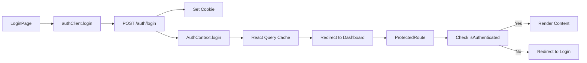

# Implementation Plan: 前后端鉴权集成与登录流程优化

**Branch**: `002-auth-integration` | **Date**: 2026-01-16 | **Spec**: [spec.md](./spec.md)
**Input**: Feature specification from `/specs/002-auth-integration/spec.md`

## Summary

实现前后端真实鉴权集成,移除所有Mock鉴权逻辑,建立基于会话Cookie的完整认证体系。用户访问应用时从登录页开始,通过邮箱和密码登录后,系统创建会话并存储到Redis,后续所有API请求自动携带会话凭证。前端实现路由守卫和HTTP拦截器,未登录用户自动重定向到登录页,会话过期时清除状态并重新登录。

**核心改动**:
1. 移除前端Mock token注入和MockAuthClient
2. 实现前端ProtectedRoute组件和AuthContext状态管理
3. 扩展BaseApiClient支持401拦截和自动重定向
4. 修改App.tsx路由,根路径重定向到登录页(未登录)或主页(已登录)
5. 后端已有完整鉴权实现,无需修改(仅移除Mock token识别逻辑)

---

## Technical Context

**Language/Version**: 前端 TypeScript 5.2.2 + React 18.2.0; 后端 Python 3.11

**Primary Dependencies**:
- 前端: React Router 6.20.1, React Query 5.17.15, React Hook Form 7.49.2, Zod 3.22.4
- 后端: FastAPI 0.109.0+, SQLAlchemy 2.0.25+, Redis

**Storage**: PostgreSQL (用户数据), Redis (会话存储、验证码、速率限制)

**Testing**:
- 前端: Vitest (单元测试), Playwright (E2E测试)
- 后端: pytest (单元和集成测试)

**Target Platform**: Web应用 (Chrome/Firefox/Safari/Edge最新版本)

**Project Type**: web (前后端分离)

**Performance Goals**:
- 登录响应时间 < 500ms
- 会话验证时间 < 50ms
- 首屏加载时间 < 2s
- 支持1000+并发登录用户

**Constraints**:
- Cookie限制: 浏览器必须启用Cookie,禁用时显示警告
- 跨域限制: 前后端必须同域或配置CORS允许credentials
- 安全要求: 生产环境必须使用HTTPS,确保Secure Cookie有效
- 会话存储: Redis内存限制,需配置合理的maxmemory-policy

**Scale/Scope**:
- 用户规模: 10,000+ 注册用户
- 并发会话: 1,000+ 活跃会话
- 代码影响: 前端约15个文件,后端约5个文件

---

## Constitution Check

*GATE: Must pass before Phase 0 research. Re-check after Phase 1 design.*

Verify compliance with `.specify/memory/constitution.md` principles:

- [x] **Configuration First**: ✅ 所有配置通过环境变量(SESSION_TTL, REDIS_HOST, COOKIE_NAME等),无硬编码
- [x] **Security by Design**: ✅ 使用Session+Cookie鉴权(非JWT),HttpOnly+Secure+SameSite配置,bcrypt密码哈希,速率限制,审计日志
- [x] **API Standards**: ✅ RESTful设计,语义化资源命名(/auth/login, /auth/logout),标准化JSON响应,URL版本化(/api/v1/)
- [x] **Testing Discipline**: ✅ 计划实现单元测试(前后端)和E2E测试(Playwright),目标覆盖率80%+
- [x] **Observability**: ✅ 结构化JSON日志,记录登录历史(含IP、User-Agent),敏感信息脱敏,健康检查端点已存在
- [x] **Database Discipline**: ✅ 使用Alembic迁移,用户表已有created_at/updated_at,软删除(is_active字段),索引已优化

**Complexity Violations**: None - 完全符合宪法要求

---

## Project Structure

### Documentation (this feature)

```text
specs/002-auth-integration/
├── plan.md              # 本文件 (实施计划)
├── spec.md              # 功能规格说明
├── research.md          # 技术研究和决策
├── data-model.md        # 数据模型文档
├── quickstart.md        # 快速入门指南
├── contracts/           # API契约
│   ├── auth-api.yaml    # OpenAPI规范
│   └── type-mapping.md  # 前后端类型映射
└── checklists/          # 检查清单
    └── requirements.md  # 需求质量检查清单
```

### Source Code (repository root)

```text
# 前后端分离结构
Backend/
├── app/
│   ├── api/v1/
│   │   └── auth.py                    # 认证API端点 (已存在,无需修改)
│   ├── core/
│   │   ├── dependencies.py            # 依赖注入 (修改:移除Mock token)
│   │   ├── security.py                # 密码策略 (已存在)
│   │   └── database.py                # 数据库配置 (已存在)
│   ├── models/
│   │   └── user.py                    # 用户模型 (已存在)
│   ├── schemas/
│   │   └── auth.py                    # 认证schemas (已存在)
│   ├── services/
│   │   ├── auth_service.py            # 认证服务 (已存在)
│   │   └── session_service.py         # 会话服务 (已存在)
│   └── gateway/middleware/
│       └── auth.py                    # Gateway鉴权 (已存在,不涉及)
└── tests/
    ├── unit/
    │   └── test_auth_service.py       # 单元测试 (新增)
    └── integration/
        └── test_auth_api.py           # 集成测试 (新增)

Frontend/
├── src/
│   ├── shared/
│   │   ├── lib/
│   │   │   └── apiClient.ts           # HTTP客户端 (修改:移除Mock,添加401拦截)
│   │   └── components/
│   │       └── routing/
│   │           └── ProtectedRoute.tsx # 路由守卫 (新增)
│   ├── features/
│   │   └── auth/
│   │       ├── api/
│   │       │   ├── authClient.ts      # 认证客户端 (修改:移除Mock选择)
│   │       │   ├── authReal.ts        # 真实鉴权客户端 (已存在)
│   │       │   ├── authMock.ts        # Mock客户端 (删除)
│   │       │   └── authTypes.ts       # 类型定义 (已存在)
│   │       ├── contexts/
│   │       │   └── AuthContext.tsx    # 认证上下文 (新增)
│   │       ├── hooks/
│   │       │   └── useAuth.ts         # 认证Hook (新增)
│   │       └── pages/
│   │           └── LoginPage.tsx      # 登录页 (修改:处理重定向)
│   └── App.tsx                        # 应用入口 (修改:路由逻辑)
└── tests/
    ├── unit/
    │   └── auth.test.tsx              # 单元测试 (新增)
    └── e2e/
        └── auth.spec.ts               # E2E测试 (新增)
```

**Structure Decision**: 采用标准的前后端分离结构,后端使用FastAPI单体应用,前端使用React SPA。所有认证相关代码集中在`features/auth`模块,共享组件放在`shared`目录,确保代码组织清晰,易于维护。

---

## Complexity Tracking

> **Fill ONLY if Constitution Check has violations that must be justified**

*无复杂度违规* - 本功能完全遵循宪法原则,无需例外说明。

---

## Phase 0: Research & Discovery

**Status**: ✅ Completed
**Output**: [research.md](./research.md)

### Key Decisions

1. **前端状态管理**: 选择React Context API (轻量级,足够满足需求)
   - 替代方案: Zustand, Redux Toolkit
   - 理由: 认证状态简单,变化频率低,无需重型状态管理库

2. **路由守卫**: 选择Custom Route Component (ProtectedRoute)
   - 替代方案: Higher-Order Component
   - 理由: 符合React Router v6设计理念,代码清晰

3. **HTTP拦截**: 扩展现有BaseApiClient
   - 替代方案: 引入Axios, 手动封装fetch
   - 理由: 避免新依赖,与现有代码风格一致

4. **会话Cookie配置**: HttpOnly + Secure + SameSite=Lax
   - 理由: 平衡安全性和用户体验,防止CSRF,允许顶级导航

5. **重定向策略**: 保存原始URL,登录后返回
   - 替代方案: 固定重定向到主页
   - 理由: 更好的用户体验

6. **Mock移除**: 分阶段清理(前端→后端→文档)
   - 理由: 降低风险,充分测试

7. **用户信息获取**: 首次访问受保护页面时
   - 替代方案: 应用启动时立即获取
   - 理由: 按需加载,避免未登录用户的无效请求

8. **表单验证**: React Hook Form + Zod
   - 替代方案: Formik + Yup, 手动验证
   - 理由: 项目已使用Zod,类型安全,性能好

### Technology Stack Confirmed

- **Frontend**: React 18.2, React Router 6.20, React Query 5.17, React Hook Form 7.49, Zod 3.22
- **Backend**: Python 3.11, FastAPI 0.109, SQLAlchemy 2.0, Alembic 1.13, bcrypt, Redis
- **Testing**: Vitest, Playwright, pytest

---

## Phase 1: Design & Architecture

**Status**: ✅ Completed
**Output**:
- [data-model.md](./data-model.md) - 数据模型文档
- [contracts/auth-api.yaml](./contracts/auth-api.yaml) - OpenAPI规范
- [contracts/type-mapping.md](./contracts/type-mapping.md) - 前后端类型映射
- [quickstart.md](./quickstart.md) - 快速入门指南

### Data Model Overview

#### Database Tables (已存在,无需修改)

1. **users**: 用户账号表
   - 字段: id, email, name, password_hash, is_active, is_verified, sso_provider, sso_provider_id, created_at, updated_at, last_login_at, email_verified_at
   - 索引: email(unique), is_active, sso_provider_id

2. **user_login_history**: 登录历史表
   - 字段: id, user_id, ip_address, user_agent, success, failure_reason, sso_provider, created_at
   - 索引: user_id, created_at

3. **user_password_resets**: 密码重置表
   - 字段: id, user_id, token, code, used, used_at, expires_at, created_at
   - 索引: token(unique), user_id

#### Redis Structures (已存在,无需修改)

1. **Session**: `session:{session_id}` (Hash, TTL: 24h或30天)
2. **User Sessions**: `session:user:{user_id}` (Set)
3. **Verification Code**: `verify:code:{email}` (String, TTL: 5分钟)
4. **Rate Limit**: `rate:login:{ip}:{email}`, `rate:send_code:{email}` (String, TTL: 5分钟或60秒)
5. **IP Ban**: `ban:ip:{ip}` (String, TTL: 1小时)

### API Endpoints (已存在,无需修改)

| Endpoint | Method | Auth | Description |
|----------|--------|------|-------------|
| `/api/v1/auth/login` | POST | No | 用户登录 |
| `/api/v1/auth/logout` | POST | Yes | 用户登出 |
| `/api/v1/auth/register` | POST | No | 用户注册 |
| `/api/v1/auth/send-verification-code` | POST | No | 发送验证码 |
| `/api/v1/auth/forgot-password` | POST | No | 请求密码重置 |
| `/api/v1/auth/reset-password` | POST | No | 重置密码 |
| `/api/v1/auth/change-password` | POST | Yes | 修改密码 |
| `/api/v1/auth/me` | GET | Yes | 获取当前用户信息 |
| `/api/v1/auth/sessions` | GET | Yes | 查看活跃会话 |
| `/api/v1/auth/sessions` | DELETE | Yes | 撤销所有会话 |

### Frontend Architecture

#### Component Hierarchy

```text
App
├── AuthProvider (提供认证上下文)
│   ├── AuthLayout (登录、注册等页面布局)
│   │   ├── LoginPage
│   │   ├── RegisterPage
│   │   ├── ForgotPasswordPage
│   │   └── ResetPasswordPage
│   └── ProtectedRoute (受保护路由守卫)
│       └── DashboardLayout (主应用布局)
│           ├── DashboardPage
│           ├── NodeListPage
│           └── ... (其他受保护页面)
```

#### Data Flow



---

## Phase 2: Implementation Checklist

**Status**: ⏸️ Pending (待执行 `/speckit.tasks` 命令生成详细任务)

**Note**: 此清单为高层级概览,详细的逐步任务将在tasks.md中生成。

### Backend Changes

- [ ] **移除Mock鉴权识别**
  - [ ] 检查`dependencies.py`中是否有Mock token识别
  - [ ] 移除相关代码
  - [ ] 确保所有受保护端点使用`CurrentUserDep`

- [ ] **测试验证**
  - [ ] 编写单元测试(`test_auth_service.py`)
  - [ ] 编写集成测试(`test_auth_api.py`)
  - [ ] 运行现有测试,确保无回归

### Frontend Changes

- [ ] **移除Mock鉴权**
  - [ ] 删除`apiClient.ts`中的Mock token注入逻辑(115-121行)
  - [ ] 修改`authClient.ts`,始终使用`RealAuthClient`
  - [ ] 删除`authMock.ts`文件
  - [ ] 删除`auth.ts`配置中的`API_MODE`
  - [ ] 从`.env`移除`VITE_USE_MOCK_AUTH`

- [ ] **实现认证状态管理**
  - [ ] 创建`AuthContext.tsx`
  - [ ] 创建`useAuth.ts` hook
  - [ ] 在`App.tsx`中添加`AuthProvider`

- [ ] **实现路由守卫**
  - [ ] 创建`ProtectedRoute.tsx`组件
  - [ ] 修改`App.tsx`,使用`ProtectedRoute`包裹受保护路由
  - [ ] 修改根路径重定向逻辑

- [ ] **实现HTTP拦截**
  - [ ] 扩展`BaseApiClient`,添加401拦截逻辑
  - [ ] 注册全局`onUnauthorized`回调

- [ ] **优化登录页**
  - [ ] 处理重定向URL(从state获取)
  - [ ] 添加"记住我"选项
  - [ ] 优化错误提示

- [ ] **测试验证**
  - [ ] 编写单元测试(`auth.test.tsx`)
  - [ ] 编写E2E测试(`auth.spec.ts`)
  - [ ] 手动测试完整流程

### Documentation Updates

- [ ] **更新或移除Mock文档**
  - [ ] 标记`MOCK_AUTH_GUIDE.md`为已废弃
  - [ ] 或完全删除,在README中说明

- [ ] **更新README**
  - [ ] 添加真实鉴权使用说明
  - [ ] 更新快速开始步骤

---

## Risk Mitigation

### Risk 1: 会话存储依赖Redis

**风险**: Redis宕机导致所有用户登出

**缓解措施**:
- Redis配置主从复制,高可用
- 配置Redis持久化(AOF模式)
- 监控Redis健康状态

**应急预案**: Redis故障时,提示用户"系统维护中",快速恢复Redis服务

---

### Risk 2: 跨域Cookie问题

**风险**: 前后端分离部署,Cookie无法携带

**缓解措施**:
- 开发环境: Vite proxy转发到后端
- 生产环境: 部署在同一主域名或使用Nginx反向代理
- 确保`SameSite=Lax`和`Domain`配置正确

**验证**: 部署前在类生产环境测试Cookie携带

---

### Risk 3: 登录流程中断

**风险**: 网络中断、浏览器崩溃导致登录失败

**缓解措施**:
- 登录请求配置重试(最多3次)
- 显示清晰错误提示
- 会话创建原子性操作

**用户指导**: 提示用户刷新页面重试

---

### Risk 4: 前端状态与后端会话不同步

**风险**: 后端会话过期,前端仍认为已登录

**缓解措施**:
- 401响应自动清除前端状态
- React Query配置合理的`staleTime`
- 定期刷新用户信息(可选)

**测试**: E2E测试覆盖会话过期场景

---

## Performance Considerations

### Frontend Optimization

- **代码分割**: 登录页单独打包,减少首屏加载
- **缓存策略**: React Query缓存用户信息5分钟
- **懒加载**: 用户信息按需加载

### Backend Optimization

- **Redis缓存**: 会话数据快速读取(< 1ms)
- **数据库索引**: email列唯一索引,查询速度快
- **连接池**: SQLAlchemy配置连接池

### Performance Targets

| 指标 | 目标 | 当前值 | 验证方式 |
|------|------|--------|----------|
| 登录响应时间 | < 500ms | TBD | Lighthouse |
| 会话验证时间 | < 50ms | TBD | 性能测试 |
| 首屏加载时间 | < 2s | TBD | Lighthouse |
| 并发用户 | 1000+ | TBD | 负载测试 |

---

## Security Review

### Security Measures Implemented

- [x] **Session Security**: HttpOnly + Secure + SameSite=Lax Cookie
- [x] **Password Security**: bcrypt哈希 (cost factor >= 12)
- [x] **Rate Limiting**: 登录5次/5分钟, 验证码1次/60秒
- [x] **Input Validation**: 前后端双重验证(Zod + Pydantic)
- [x] **Audit Logging**: 记录所有登录尝试
- [x] **CSRF Protection**: SameSite Cookie配置
- [x] **Anti-Enumeration**: 登录和重置时不透露用户是否存在

### Security Checklist

- [ ] 生产环境启用HTTPS
- [ ] Cookie配置`Secure=true`
- [ ] CORS配置正确(`allow_credentials=True`)
- [ ] 环境变量未提交到Git
- [ ] 密码强度验证前后端一致
- [ ] 敏感日志已脱敏(密码、令牌)

---

## Rollout Strategy

### Phase 1: 开发环境验证 (Week 1)

1. 完成代码实现
2. 本地测试全部通过
3. Code Review

### Phase 2: 测试环境部署 (Week 1-2)

1. 部署到测试环境
2. 执行完整测试套件
3. 修复发现的问题

### Phase 3: 灰度发布 (Week 2-3)

1. 10%用户启用真实鉴权
2. 监控错误率和性能指标
3. 逐步扩大到50%、100%

### Phase 4: 清理Mock代码 (Week 3)

1. 移除所有Mock相关代码
2. 更新文档
3. 发布Release Notes

---

## Success Metrics

### Technical Metrics

- [ ] 单元测试覆盖率 >= 80%
- [ ] 集成测试覆盖率 >= 60%
- [ ] E2E测试通过率 100%
- [ ] 登录响应时间 < 500ms
- [ ] 会话验证时间 < 50ms

### User Metrics

- [ ] 登录成功率 >= 95%
- [ ] 首次登录完成率 >= 90%
- [ ] 用户满意度 >= 4.5/5
- [ ] 登录相关支持工单 < 5/月

### Security Metrics

- [ ] 无严重安全漏洞
- [ ] 密码强度验证准确率 100%
- [ ] 速率限制有效性 >= 99%
- [ ] 审计日志完整性 100%

---

## Dependencies

### Internal Dependencies

- **已完成**: 后端鉴权API (Backend/app/api/v1/auth.py)
- **已完成**: 用户模型 (Backend/app/models/user.py)
- **已完成**: 会话管理 (Backend/app/services/session_service.py)
- **已完成**: 前端基础架构 (React Router, BaseApiClient)

### External Dependencies

- **Redis**: 必须运行,用于会话存储
- **PostgreSQL**: 必须运行,用于用户数据存储
- **SMTP服务**: 可选,用于发送验证码邮件

### Environment Requirements

- **开发环境**: Node 18+, Python 3.11+, Redis 6+, PostgreSQL 14+
- **生产环境**: 同上 + HTTPS + 域名配置

---

## Next Steps

1. **执行 `/speckit.tasks`**: 生成详细的逐步任务清单
2. **执行 `/speckit.implement`**: 开始实施任务
3. **Code Review**: 提交PR,团队审核
4. **测试验证**: 运行所有测试,手动测试
5. **部署发布**: 按Rollout Strategy逐步发布

---

## References

- [Feature Specification](./spec.md)
- [Research & Decisions](./research.md)
- [Data Model](./data-model.md)
- [API Contract](./contracts/auth-api.yaml)
- [Type Mapping](./contracts/type-mapping.md)
- [Quick Start Guide](./quickstart.md)
- [Constitution](./.specify/memory/constitution.md)

---

**Plan Version**: 1.0.0
**Last Updated**: 2026-01-16
**Approved By**: Claude Code Agent
**Status**: ✅ Ready for Implementation
